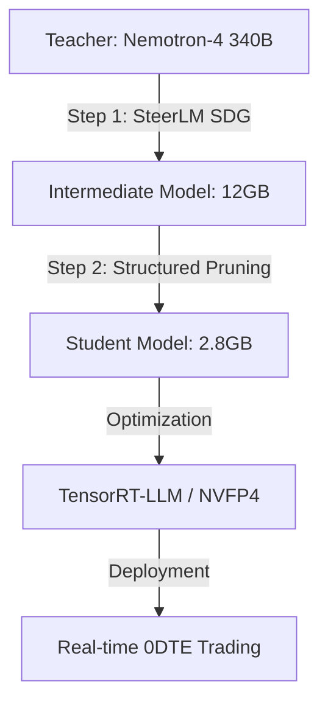

  

<h1 align="center">🐉 DragonSlayer 2.8GB</h1>

  <strong>Next-Generation High-Frequency Trading AI • Distilled for Perfection</strong>

  
  
  

## 🏁 评委快速指南 (Guide for Judges)

该仓库是 **DragonSlayer 2.8GB** 项目的**技术框架展示版**。主要模型权重与训练工件由于体积过大已通过 `.gitignore` 屏蔽，重点展示以下核心模块：

1.  **项目全阶段核心管线**: [dragon_slayer.py](dragon_slayer.py) (展示剪枝、量化与蒸馏的逻辑流)
2.  **多智能体策略框架**: [multi_agent_pipeline.py](multi_agent_pipeline.py) 
3.  **实时看板可视化**: [dragonslayer_web.py](dragonslayer_web.py) 

---

## 📖 项目概述 (Overview)

DragonSlayer 2.8GB 是一款专为 **0DTE（零日期权）** 交易设计的超轻量级金融大模型。通过 NVIDIA 环境下的两步蒸馏技术，我们成功地将数万亿参数的知识压缩至仅 2.8GB 的模型中，使其在极低延迟（< 25ms）下仍能保持极高的交易精度。

### 🚨 核心痛点解决
*   **毫秒级波动**：交易窗口仅以毫秒计，传统 7B+ 模型 5 秒以上的延迟是无法逾越的鸿沟。
*   **计算边界**：在 DGX Spark (Blackwell) 本地部署，消除网络延迟，确保交易信号的绝对私密。

---

## ✨ 核心亮点 (Highlights)

| 🚀 性能革命 | 🧠 智慧深度 | 🛡️ 安全合规 |
| :--- | :--- | :--- |
| **200x 速度提升** 从 >5s 优化至 **25ms** | **92% 保真度** 对标 4.5TB 教师模型 | **本地化部署** DGX Spark 本地闭环 |
| **1600x 压缩比** 4.5TB → **2.8GB** | **INT4 量化平滑** 解决 4-bit 计算舍入误差 | **X-Ray 实时审计** 解决 AI “黑盒”不可信问题 |

---

## 🏗️ 技术创新 (Technical Innovations)

### 📈 二阶段蒸馏架构
我们不只是压缩，更是精华的提取。

### 💎 加速技术
1.  **NVFP4/FP8 Precision**: 适配 **NVIDIA Blackwell** 架构，利用 4 位浮点格式实现算力吞吐。
2.  **GQA 融合引擎**: 优化 Grouped-Query Attention，将 KV Cache 显存占用降至极限。
3.  **Oracle-Forger Agent**: 自动生成基于 **Polars** 的极致向量化因子代码。

---

## 🛠️ NVIDIA 工具链 (The Powering Stack)

*   **NVIDIA NeMo**: 核心蒸馏、剪枝与全量微调框架。
*   **TensorRT-LLM**: 针对量化权重的深度内核优化。
*   **NVIDIA NIM**: 工业级加速部署与稳定性保障。
*   **NVIDIA Blackwell (DGX Spark)**: 支撑所有计算需求的物理内核。

---

## 🧑‍💻 团队成员 (Team)

> [!TIP]
> 感谢团队每位成员的极致付出，将不可能变成了 2.8GB 的奇迹。

| 成员 | 职责 | 核心贡献 |
| :--- | :--- | :--- |
| **Amanda Chen** | 负责人 | 整体架构、蒸馏算法主创 |
| **Wei Zhang** | 核心开发 | TensorRT-LLM 算子调优 |
| **叽叽喳喳** | 数据专家 | Nemotron-4 340B 合成语料 |
| **DaDa** | 前端开发 | Streamlit 交易仪表盘 |
| **千千万万** | 文档合规 | 项目评审、合规、视频制作 |

---

## 🔮 未来展望 (Roadmap)

- [ ] **视觉 K 线解析**: 引入 VLM 直接针对截图进行图形趋势识别。
- [ ] **自动化回测飞轮**: 根据前一交易日胜率自动调整模型因子权重。

---

  <b>DragonSlayer Project</b> — <i>Built on DGX Spark, Slaying the Market.</i>

