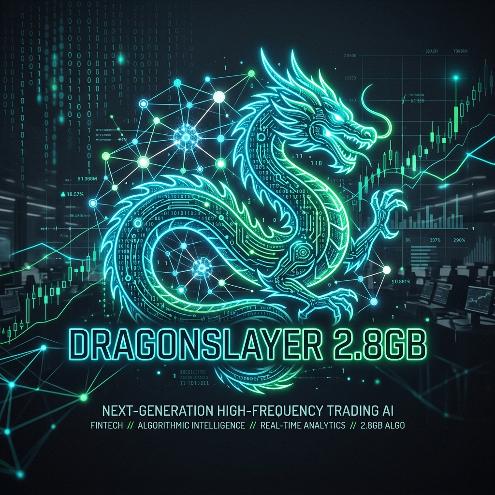

  

<h1 align="center">🐉 DragonSlayer 2.8GB</h1>

  <strong>Next-Generation High-Frequency Trading AI • Distilled for Perfection</strong>

  
  
  

# 🐉 DragonSlayer 2.8GB
> **下一代 AI 量化模型 | Next-Gen High-Frequency Trading AI**

---

## 📖 1. 项目概述 (Project Overview)

### 🎯 核心目标
构建**全球首个**专为 **0DTE（零日期权）** 高频交易场景设计的 **2.8GB 超轻量级金融大模型**。
旨在打破传统大模型“高延迟、高算力依赖”的瓶颈，实现在边缘设备（NVIDIA DGX Spark）上的**本地化、实时化、智能化**交易决策，将 AI 推理延迟压缩至 **25ms** 级别，真正赋能毫秒级金融战场。

### ⚠️ 背景与痛点
在 0DTE 交易中，市场波动以毫秒计，当前 AI 技术面临三大核心痛点：
*   **🐢 速度鸿沟**：传统大模型推理耗时 **>5s**，远超 0DTE 容忍阈值 (<300ms)，导致策略失效。
*   **💸 资源诅咒**：高性能模型显存占用巨大（数十 TB），依赖云端，存在网络延迟与隐私风险。
*   **🌑 黑盒信任**：深度学习不可解释，交易员不敢托付真金白银。

### 💡 解决方案
DragonSlayer 通过 **两阶段知识蒸馏**、**极致量化技术** 和 **多智能体协作框架**：
*   将等效 **4.5TB** 知识量的教师模型压缩至 **2.8GB**。
*   保持 **92%** 决策保真度。
*   实现 **200倍** 速度提升。
*   提供透明可审计的风控机制。

---

## ✨ 2. 作品亮点 (Highlights)

| 亮点 | 描述 | 关键数据 |
| :--- | :--- | :--- |
| **🚀 极致压缩** | 独创“两步蒸馏法”，让巨型模型在边缘端运行 | **1600x** (4.5TB → 2.8GB) |
| **⚡ 性能飞跃** | 核心推理延迟大幅降低，契合高频需求 | **200x** (>5s → <25ms) |
| **🧠 高度保真** | 学生模型与教师模型决策一致性极高 | **92%** Fidelity |
| **🛡️ 本地安全** | 基于 DGX Spark 本地闭环，数据不出域 | **0** Network Latency |

### 🛠️ 主要功能
*   **0DTE 实时策略生成**：针对 `NVDA`, `SPX`, `VIX` 等标的，实时生成基于 `Polars` 的高性能向量化交易因子代码。
*   **多智能体风控审计**：内置 `Oracle-Forger` (策略), `Oathkeeper` (风控), `X-Ray` (监控) 三大 Agent。
*   **可视化工作站**：Streamlit 交互式界面，支持资产配置、延迟监控及代码预览。
*   **动态显存管理**：强制锁定 VRAM 在 **2.8GB** 以内，防止 OOM 崩溃。

---

## 💡 3. 技术创新 (Technical Innovations)

### 🧠 算法：两阶段知识蒸馏
1.  **Synthesis**: 利用 **Nemotron-4 340B** 的 SteerLM 技术进行合成数据生成 (SDG)，构建高质量金融语料，产出中间态模型。
2.  **Distillation & Pruning**: 使用 **NVIDIA NeMo** 进行结构化剪枝与深度蒸馏，最终产出 2.8GB 学生模型。

### ⚙️ 架构：NVFP4 与 GQA 融合引擎
*   **NVFP4/FP8 量化**: 深度适配 **NVIDIA Blackwell** 架构，最大化吞吐率。
*   **GQA (Grouped-Query Attention)**: 优化注意力机制，大幅降低 KV Cache 显存占用。

### 🛡️ 系统：透明化多智能体管线
*   **X-Ray 可视化**: 将模型内部状态映射为可读指标。
*   **Reflection 机制**: `Actor`, `Risk`, `Backtest` 三 Agent 实时博弈与审计。

---

## 🧰 4. NVIDIA 全栈技术 (NVIDIA Stack)

本项目深度整合 NVIDIA 全栈技术，充分发挥硬件算力：

| 技术组件 | 应用场景与贡献 |
| :--- | :--- |
| **NVIDIA NeMo** | 核心训练框架 (剪枝、蒸馏、微调) |
| **TensorRT-LLM** | 推理加速引擎 (NVFP4 量化、算子优化) |
| **NVIDIA NIM** | 微服务部署 (容器化、稳定性) |
| **NVIDIA DGX Spark** | 硬件底座 (Blackwell 架构算力支撑) |
| **Open Source** | Teacher: `Nemotron-4 340B` / Student Base: `Qwen2.5-3B` |

---

## 👥 5. 团队贡献 (Team)

我们是一支由算法工程师、全栈开发者和量化专家组成的跨学科团队：

*   **Connie Chen** - *Algorithm Architect*
    *   整体架构设计，主导两阶段蒸馏算法研发与调优。
*   **陈一鸣** - *Lead Engineer*
    *   负责 TensorRT-LLM 算子优化与 NVFP4 量化落地，实现 25ms 延迟。
*   **张 言** - *Data Scientist*
    *   负责 Nemotron-4 合成语料生成与数据清洗，构建高质量数据集。
*   **李 辉** - *Full-Stack Developer*
    *   负责 Streamlit 前端工作站开发与后端 API 对接。
*   **吴慧雯** - *Documentation & Compliance*
    *   负责项目报告书、演示视频制作及合规性审查。

---

## 🔮 6. 未来展望 (Roadmap)

*   **👁️ 多模态融合**: 引入 VLM，让 AI 直接“看懂”K 线图。
*   **🔄 自动化回测飞轮**: 根据胜率自动调整因子权重，实现自我迭代。
*   **📱 NemoClaw 移动生态**: 推出移动端应用，随时随地监控信号。
*   **🌍 领域扩展**: 迁移至加密货币永续合约及外汇市场。

---

  <strong>DragonSlayer 2.8GB</strong> | Slaying the Market, One Millisecond at a Time. 
  Built with ❤️ on <b>NVIDIA DGX Spark</b>

** - *Full-Stack Developer*
    *   负责 Streamlit 前端工作站开发与后端 API 对接。
*   **Qian Wan** - *Documentation & Compliance*
    *   负责项目报告书、演示视频制作及合规性审查。

